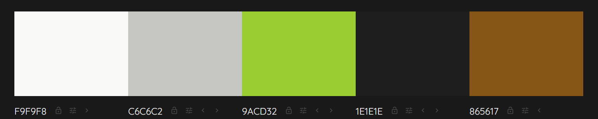
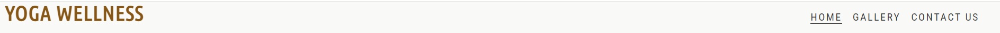
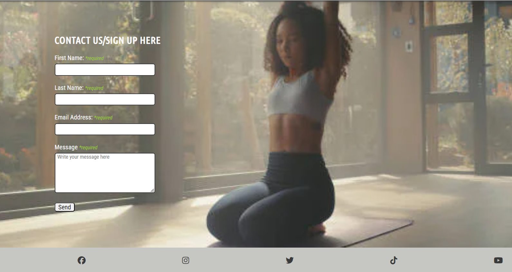
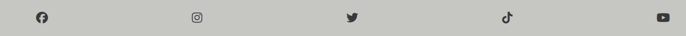
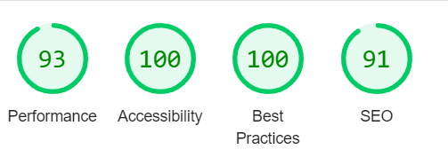
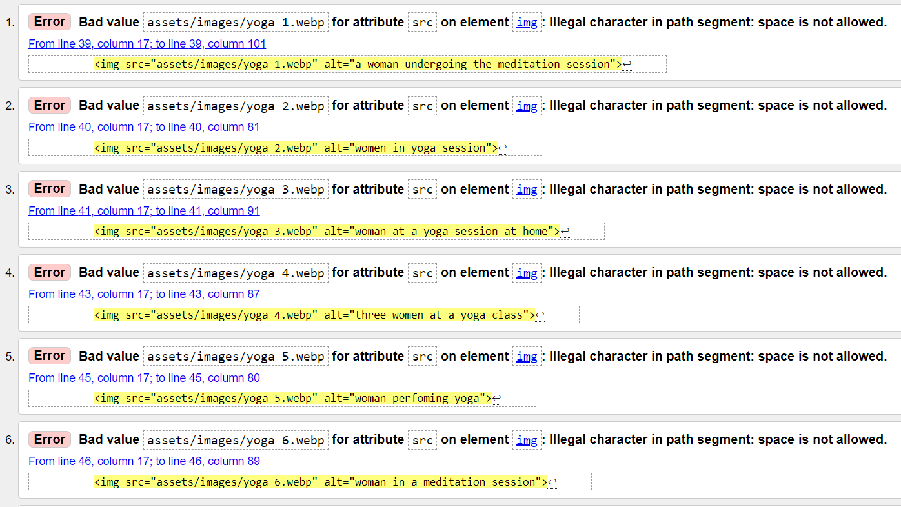

# YOGA WELLNESS

Yoga Wellness is a wellness center located in Portlaoise, Ireland. The website provides information about yoga classes, meditation sessions, and other wellness activities. It includes a home page, a gallery page, and a contact page.

Welcome to your wellness journey through <a href="https://taiwoogbonyomi.github.io/Project-1/index.html" target="_blank" rel="noopener">Yoga Wellness</a>

# Contents

* [**User Experience UX**](<#user-experience-ux>)
    *  [User Stories](<#user-stories>)
    *  [Target Audience](<#target-audience>)
    * [Wireframes](<#wireframes>)
    * [Site Structure](<#site-structure>)
    * [Design Choices](<#design-choices>)
    *  [Typography](<#typography>)
    *  [Colour Scheme](<#colour-scheme>)

* [**Features**](<#features>)
    * [**Home**](<#navigation-menu>)
         * [Navigation menu](<#navigation-menu>)
         * [Gallery](<#gallery>)
         * [Contact-us](<#about-us>)
         * [Footer](<#footer>)
    *  [**Future Features**](<#future-features>)
* [**Technologies Used**](<#technologies-used>)
    * [**Languages**](<#languages>)
* [**Testing**](<#testing>)
* [**Deployment**](<#deployment>)
* [**Bugs**](<bugs>)
* [**Credits**](<#credits>)
*  [**Acknowledgements**](<#acknowledgements>)

## Responsive Screenshot

Below is the screenshot of the responsive website, created using Am I Responsive.

---
[Back to top](<#contents>)

# User Experience (UX)

## User Stories

* As a user, I want to be able to navigate through the whole site without any glitch.
* As a user, I want to be able to understand the purpose of the site upon loading the site.
* As a user, I want to learn about Yoga Wellness so I can understand what services they offer.
* As a user, I want to view images of yoga and meditation sessions, so I can see what to expect.
* As a user, I want to contact Yoga Wellness, so I can inquire about classes or send a message.
* As a user, I want to easily navigate the website on my mobile device, so I can access information on the go.
* As a user, I want to follow Yoga Wellness on social media, so I can stay updated with their latest activities and news.

[Back to top](<#contents>)

### Target Audience

The target audience is designed to cater to a diverse audience interested in yoga, wellness, holistic health and individuals who do yoga for spirituality, physical fitness, stress relief or a mix of these motivations.

---

### Wireframe

The wireframes for Yoga Wellness were produced in [Balsamiq](https://balsamiq.com).. Below is the screenshot of mobile/ tablet and desktop browser design.

[Back to top](<#contents>)

## Site Structure

Yoga Wellness website has three pages. The [home page](index.html) is the default loading page, [gallery](gallery.html) and [contact](contact.html) pages are all accessible primarily from the navigation menu.

### Home Page

The home page features the benefits of yoga and meditation and as a form of fitness. It also features the yoga class times, days and venues.

### Gallery Page

This page has different photos of people engaging in yoga as a form of meditation and fitness excercise.

### Contact page

The contact page consist of a sign up and enquiry form for yoga classes.

[Back to top](<#contents>)

## Design Choices

* ### Typography 

    The typography for the Yoga Wellness website aims to create a clean, modern, and welcoming aesthetic that enhances readability and conveys a sense of calm and professionalism. The chosen fonts are from Google Fonts, ensuring accessibility and ease of use.  
    * Roboto Condensed was used for general text, body content and smaller headings. This font is sans serif which provides a modern and clean look, it is highly readable and versatile.
    * Ubuntu Condensed was used for the main headings. It has a unique and slightly condensed appearance which helps headings stand out while maintaining clean and modern look. 

* ### Color Scheme
    The color palette for the Yoga Wellness website is chosen to evoke feelings of calm, balance, and natural beauty. The colors are inspired by earthy tones and natural elements, reflecting the themes of wellness, meditation, and yoga.
    * Earthy brown color is used for headers and highlights to provide a sense of grounding and stability. It evokes natural elements and connects with the essence of yoga.
    * Deep gray color is used for the main body text, providing a neutral and calming backdrop that is easy on the eyes, ensuring readability and a clean look.
    * Light gray color is used for the background of various sections, creating a soft and inviting canvas that contrasts gently with the primary colors without being too stark.
    * Yellow-green color is used to indicate required fields and small accents, adding a touch of vibrancy and emphasizing important areas in forms and interactions.
    * Soft white color is used for form backgrounds and buttons to create a fresh and simple look, ensuring that these elements stand out without overwhelming the user.
    * Transparent black color is used for overlays, such as the yoga class section background, to provide depth and focus without being opaque, maintaining a sense of openness.

# Features

The Yoga Wellness website is designed to offer a comprehensive and user-friendly experience for individuals interested in yoga, meditation, and overall wellness. Below is a detailed overview of the key features available on the website.

## Existing Features

* ### Navigation bar
    
    * The nav bar features the menu on the header and will help the end users to navigate easily while on the site.A smooth 
      transition dropdown menu enhances the user experience and adds visual appeal, hence the use of bar-icon from font awesome to design the menu bar.

[Back to top](<#contents>)

* ### Gallery

    * The gallery contains a collection of images showcasing various yoga and meditation sessions, providing visitors with a visual understanding of what to expect. The gallery adjusts to different screen sizes, ensuring a seamless experience across devices.

.png)
[Back to top](<#contents>)

* ### Contact Us

    * Allows users to get in touch or sign up for newsletters and updates. it contains a clearly marked required fields to ensure necessary information is collected and a soothing background image to maintain the website's aesthetic and theme.

[Back to top](<#contents>)     

* ### Footer

    * Contains links to social media platforms such as Facebook, Instagram, Twitter, TikTok, and YouTube to help user dive more into what Yoga Wellness is all about. Each social media link is labeled for accessibility purposes, informing users that the link opens in a new tab.

[Back to top](<#contents>)

## Future Features

* Online class and workshop : Embedding live streams or recorded sessions directly on the website for users who cannot attend in person or prefer practicing at home. 
* User Accounts and Profiles : Providing a personalized dashboard where users can view their class history, upcoming sessions, and personalized recommendations.
* E-commerce for Wellness Products : Introducing an e-commerce section where users can purchase yoga mats, meditation cushions, wellness books, and other related products.

[Back to top](<#contents>)

---

## Technologies Used

* [Github](https://github.com/) - used for hosting, deployment and publishing the project online.
* [Gitpod](https://www.gitpod.io/#get-started)- used to create,change and merge files and codes.
* [HTML5](https://html.spec.whatwg.org/) - The core of the site was built with HTML version 5 .
* [CSS](https://www.w3.org/Style/CSS/Overview.en.html) - used css to style the website and define fonts and layout. 
* **Python** - I used python 3 via terminal to preview my site using a local http server.

---
[Back to top](<#contents>)

### Languages 

HTML, CSS

---

## Deployment 

### Deployment

### **To deploy the project**
The site was deployed to GitHub pages. The steps to deploy a site are as follows:
  1. In the GitHub repository, navigate to the **Settings** tab.
  2. Once in Settings, navigate to the **Pages** tab on the left hand side.
  3. Under **Source**, select the branch to **master**, then click **save**.
  4. Once the master branch has been selected, the page will be automatically refreshed with a detailed ribbon display to indicate the successful deployment.

### Local Development

#### How to Clone

1. Log into your account on github
2. Go to the repository of this project /taiwoogbonyomi/Project-1/
3. Click on the code button, and copy your preferred clone link.
4. Open the terminal in your code editor and change the current working directory to the location you want to use for the cloned directory.
5. Type 'git clone' into the terminal, paste the link you copied in step 3 and press enter.

#### How to Fork

To fork the repository:

1. Log in (or sign up) to Github.
2. Go to the repository for this project, taiwoogbonyomi/Project-1
3. Click the Fork button in the top right corner.

[Back to top](<#contents>)

## Testing
## Code Validation
The Yoga Wellness website has been throughly tested. All the code has been run through the [W3C html Validator](https://validator.w3.org/) and the [W3C CSS Validator](https://jigsaw.w3.org/css-validator/). Minor errors were found on the gallery page. After a fix and retest, no errors were returned for both. 

* Home page

* Gallery page

* Contact page

* Jigsaw CSS Validator result

 - Pass

### Lighthouse

I used Chrome's Lighthouse developer tool to check my websites performance and the performance is good.

### Website Full Testing

Full testing was performed on different devices:

* Laptop
    * HP
* Mobile Phones
    * Iphone 14
    * Samsung Galaxy

Each devices were tested on 
* Google chrome 
* Mozilla Firefox  
* Safari browser.

[Back to top](<#contents>)

### Bugs
* ### Resolved

    * Few bugs became known during the validation stage, a brief description is below:

    * gallery page - 
    
* The bugs were resolved by removing the spaces in the naming of the images and replacing them with an hyphen.

* Fixed bug where the header was covering the main content after adding the meditation image, This was fixed by changing the position of the image from absolute to fixed .
* Updated the background image to cover the full screen of the devices.
* Fixed a bug where the footer was not showing the social media icon. This was fixed by changing the dark background-color that overshadowed the social media icons to grey.
* Fixed a bug where the form was not displaying well on the mobile device, This was fixed by modifying the padding.
---

[Back to top](<#contents>)

### Credits

* [Font Awesome](https://fontawesome.com/) - Used to add icon to the Social Media links .
* [Google Chrome](https://www.google.com/chrome/) - The website was built and tested in google Chrome.
* [Favicon Generator Website](https://favicon.io/favicon-generator/) - Converted JPG file gotten from pixabay into a favicon 
* [Pixelied](https://pixelied.com/convert/png-converter/png-to-webp) - Used to convert JPG images to WEBP .
* [Pixabay](https://pixabay.com/illustrations/) - Used to generate all the images used in home page and the gallery section .
* [Google Chrome](https://www.google.com/chrome/) - The website was built and tested in google Chrome .
* [Pixelied](https://pixelied.com/convert/png-converter/png-to-webp) - Used to convert JPG images to WEBP .
* [AmIResponsive](https://ui.dev/amiresponsive) - which I used for create a responsive screenshot of all screen sizes.
* [Harvard Health](https://www.health.harvard.edu/staying-healthy/yoga-benefits-beyond-the-mat) where I got the benefits of yoga.
* The Loverunning walkthrough project where I got all my guidelines.

[Back to top](<#contents>)

# Acknowledgements
The website was completed as a Portfolio 1 Project for the Full Stack Software Developer Diploma at the [Code Institute](https://codeinstitute.net/). I would like to thank my mentor Precious Ijege, the Slack community, and all at the Code Institute for their help and support.