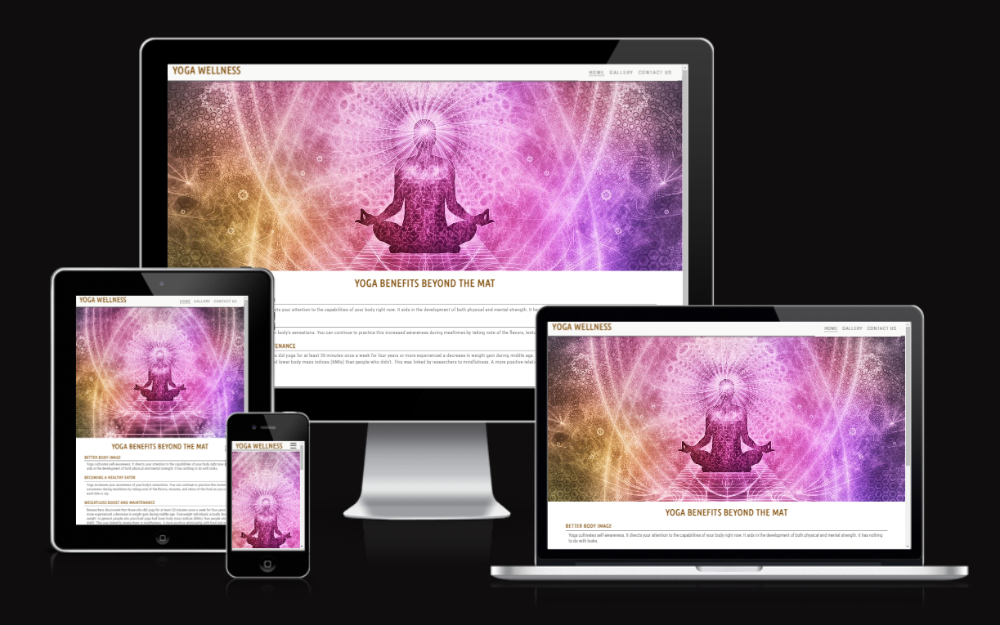
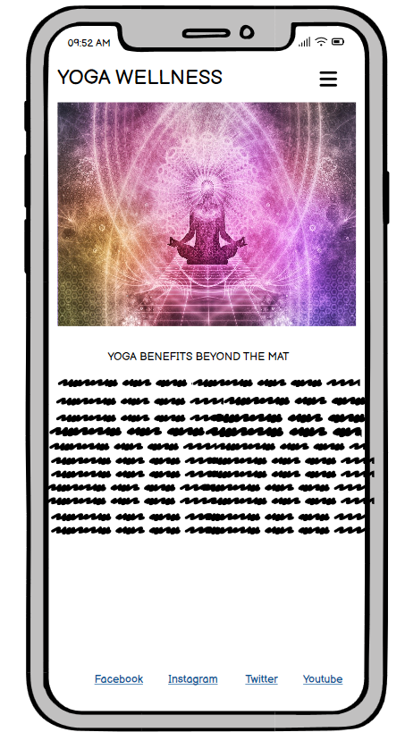
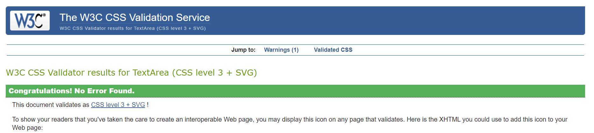

# YOGA WELLNESS

Visit the live website [here!] (https://taiwoogbonyomi.github.io/Project-1/)

This is the website for yoga classes named "Yoga Wellness". It is designed to be functional and responsive on all devices, this helps users to be able to book in their yoga session from anywhere and on any size of device.

---

Click here for Table of Contents

[Responsive Screenshots](#responsive-screenshot)

[Target Audience](#target-audience)

[General Features](#general-features)

[Wireframe](#wireframe)

[Sites and Frameworks](#sites-and-frameworks)

[languages](#languages)

[Deployment](#deployment)

[Testing](#testing)

[Credits](#credits)

## Responsive Screenshot

Below is the screenshot of the responsive website, created using Am I Responsive.

---

## TARGET AUDIENCE

The target audience are individuals who do yoga for spirituality, physical fitness, stress relief or a mix of these motivations.

---

### General features

### Home Page

The home page features the benefits of yoga and meditation and as a form of fitness. It also features the yoga class times, days and venues.

### Gallery Page

This page has different photos of people engaging in yoga as a form of meditation and fitness excercise.

### Contact page

The contact page consist of a sign up and enquiry form for yoga classes.

### Footer with social media icons

I used font awesome to design the icon of the 4 social media icons found on the footer of the website.

### Nav bar

The nav bar features the menu on the header and will help the end users to navigate easily while on the site.A smooth transition dropdown menu enhances the user experience and adds visual appeal, hence the use of bar-icon from font awesome to design the menu bar. 

To maximize compatibility, I converted the original Jpg images to a Webp file using Pixelied. This, in my opinion, should cover all feasible accepted file types across all platforms. 

The favicon was generated from images downloaded from pixabay and exported as.ico files for compatibility. 

### Fonts

I used the google fonts Roboto-Condensed and Ubuntu-Condensed because they are professional fonts used by web designers for technical layouts and economical use of space in layouts.

### Wireframe

I used balsamic to design my wireframe. Below is the screenshot of mobile/ tablet and desktop browser design.
 

---

## Sites and frameworks 

**Github** - I used github for storing my work and for deployment and publishing online.\
**Gitpod** - Used to create,change and merge files and codes.\
**Python** - I used python 3 via terminal to preview my site using a local http server.\
**HTML5** - The core of the site was built with HTML version 5.\
**CSS** - I used css to style the website and define fonts and layout.\
**Font Awesome** - Used to add icon to the Social Media links.\
**Google Chrome** - The website was built and tested in google Chrome.\
**Favicon Generator Website** - Converted JPG file that I made from the logo using pixabay and converted it into a favicon on website favicon.io\
**Pixelied** - Used to convert JPG images to WEBP.\
**Pixabay** - Used to generate all the images used in the gallery section.

---

### Languages 

HTML, CSS

---

## Deployment 

### Deployment

My website was deployed on gitpages.

### Local Development

#### How to Clone

1. Log into your account on github
2. Go to the repository of this project /taiwoogbonyomi/Project-1/
3. Click on the code button, and copy your preferred clone link.
4. Open the terminal in your code editor and change the current working directory to the location you want to use for the cloned directory.
5. Type 'git clone' into the terminal, paste the link you copied in step 3 and press enter.

#### How to Fork

To fork the repository:

1. Log in (or sign up) to Github.
2. Go to the repository for this project, taiwoogbonyomi/Project-1
3. Click the Fork button in the top right corner.

## Testing
## Manual Testing

### Jigsaw CSS Validator

[Jigsaw](https://jigsaw.w3.org/css-validator/validator) was used to validate the css code
 - Pass

### W3C Validator

[W3C](https://validator.w3.org/) was used to validate the HTML on all pages of the website. It was also used to validate the CSS.

### Lighthouse

I used Chrome's Lighthouse developer tool to check my websites performance and the performance is good.

### Website Full Testing

Full testing was performed on different devices:

* Laptop
    * HP
* Mobile Phones
    * Iphone 14
    * Samsung Galaxy

Each devices were tested on * Google chrome * Mozilla Firefox and * Safari browser.

### Bugs

* Fixed bug where the header was covering the main content after adding the meditation image.
* Updated the background image to cover the full screen of the devices.
* Fixed a bug where the footer was not showing the social media icon. This was fixed by changing the dark background-color that overshadowed the social media icons.
* Fixed a bug where the form was not displaying well on the mobile device.
---
### Credits

* The Loverunning walkthrough project where I got all my guidelines.

* Pixabay.com, where I got all the images used for my website.

* Favicon.io generator website.

* Font awesome where I got the Icons used in the social media links and the menu bar.

* pixelied.com, which I used in converting the JPG images to WEBP.

* Ui.dev Am I Responsive which I used for create a responsive screenshot of all screen sizes.

* health.harvard.edu where I got the benefits of yoga.
